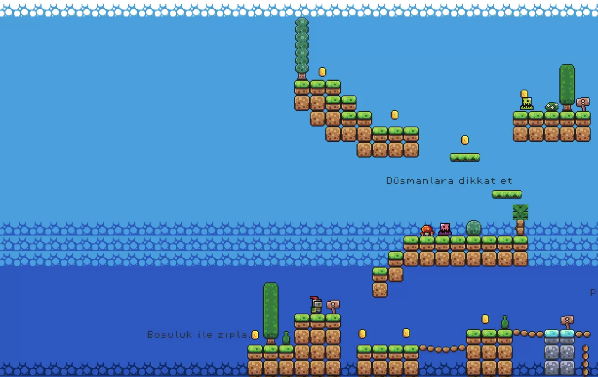

# Godot Basic Platform Game

Welcome to **Godot Basic Platform Game**, a simple platformer game created using Godot Engine. In this game, you control a knight who collects gold and progresses through levels.

## Table of Contents
- [Game Description](#game-description)
- [Screenshots](#screenshots)
- [Installation](#installation)
- [How to Play](#how-to-play)
- [Contributing](#contributing)

## Game Description
**Godot Basic Platform Game** is a basic platformer where the player controls a knight character. The objective is to collect gold scattered across the levels while avoiding obstacles and enemies.

## Screenshots



## Installation

1. **Clone the repository:**
    ```sh
    git clone https://github.com/TypeCc/Godot-Basic-Platform-Game.git
    ```

2. **Navigate to the project directory:**
    ```sh
    cd Godot-Basic-Platform-Game
    ```

3. **Open the project in Godot Engine:**
    - Launch Godot Engine.
    - Click on the "Import" button.
    - Select the `project.godot` file located in the project directory.

## How to Play

1. **Start the game:**
    - Click the "Play" button in the main menu.

2. **Controls:**
    - **Arrow Keys**: Move the knight left or right.
    - **Space Bar**: Jump.

3. **Objective:**
    - Collect all the gold coins in the level.

4. **Game Over:**
    - The game ends if the knight's touch to slime or falling down.

## Contributing
Contributions are welcome! If you'd like to contribute, please follow these steps:

1. **Fork the repository.**
2. **Create a new branch.**
    ```sh
    git checkout -b my-feature-branch
    ```
3. **Make your changes and commit them.**
    ```sh
    git commit -m "Add some feature"
    ```
4. **Push to the branch.**
    ```sh
    git push origin my-feature-branch
    ```
5. **Create a new Pull Request.**


## Credits
- **Developer:** [TypeCc](https://github.com/TypeCc)
- **Engine:** Godot Engine
- **Brackeys:** [Brackeys](https://www.youtube.com/@Brackeys)
- **Artwork:** [Link](https://brackeysgames.itch.io/brackeys-platformer-bundle)
- **Sound Effects:** Provided by free online resources.

---

Feel free to customize this README file as needed. Happy gaming!

